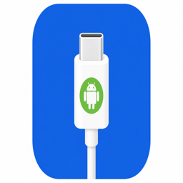
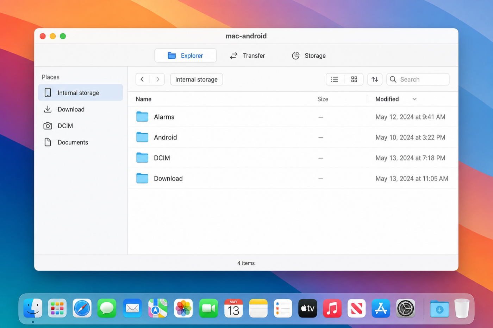
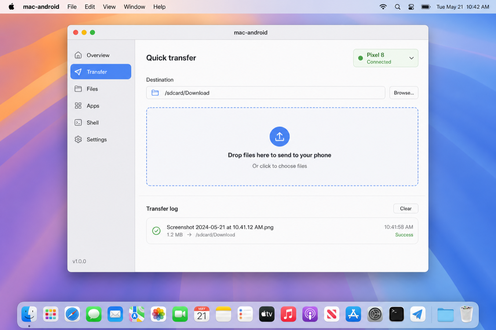
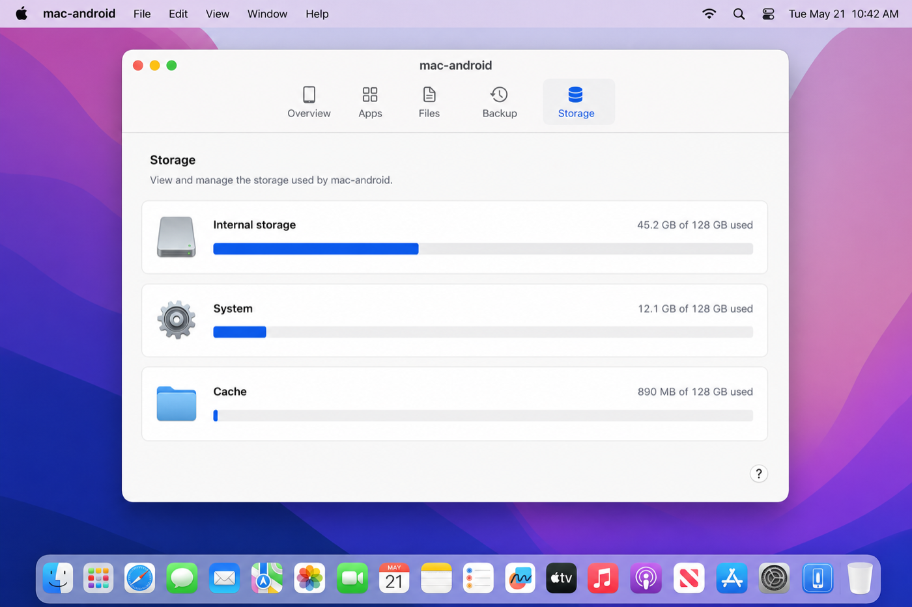

# mac-android

<p align="center">
  
</p>

<p align="center">
  <strong>Move files between your Mac and an Android phone over USB.</strong><br>
  No cloud, no Wi‑Fi — just a cable.
</p>

<p align="center">
  <a href="https://github.com/pedromvpg/mac-android/actions/workflows/ci.yml"></a>
  <a href="https://github.com/pedromvpg/mac-android/releases/latest"></a>
  <a href="LICENSE"></a>
  <a href="https://github.com/pedromvpg/mac-android/releases/latest"></a>
</p>

Comes as both a **GUI app** (drag-and-drop) and a **CLI tool**, powered by [adb](https://developer.android.com/tools/adb).

## Download

**GUI app** — drag-and-drop, no Terminal needed:

➜ [**Download the latest `.dmg`**](https://github.com/pedromvpg/mac-android/releases/latest)

Open the DMG, drag `mac-android.app` to your Applications folder, and launch it.

**CLI tool** — install from source:

```bash
git clone https://github.com/pedromvpg/mac-android.git
cd mac-android
./install.sh
mac-android setup
```

## Screenshots

<table>
  <tr>
    <td align="center"><strong>Explorer</strong><br>Browse your phone's filesystem</td>
    <td align="center"><strong>Transfer</strong><br>Drag-and-drop to push files</td>
    <td align="center"><strong>Storage</strong><br>See used and free space</td>
  </tr>
  <tr>
    <td></td>
    <td></td>
    <td></td>
  </tr>
</table>

## Prerequisites

- macOS 14 or later
- [Homebrew](https://brew.sh) (for one-time `adb` install via `mac-android setup`)
- Android device with **USB debugging** enabled

### Enable USB debugging on Android

1. **Settings → About phone** → tap **Build number** 7 times
2. **Settings → Developer options** → turn on **USB debugging**
3. Connect via USB and tap **Allow** on the debugging prompt

## GUI

The app provides drag-and-drop push, a built-in file explorer to browse your phone's filesystem, and a transfer log.

| Tab | What it does |
|-----|-------------|
| **Explorer** | Browse folders, pull files to your Mac, drag files in to upload |
| **Transfer** | Drop files here to push them to `/sdcard/Download` (or a custom path) |
| **Storage** | View used and free space per volume |
| **Log** | Per-transfer history with success/failure details |

To build the GUI from source:

```bash
./gui/build.sh          # produces mac-android.app in the project root
open mac-android.app
```

## CLI Usage

```bash
# Check connection
mac-android devices

# Mac → Android (defaults to /sdcard/Download)
mac-android push ~/Pictures/photo.jpg
mac-android push ~/Documents/report.pdf /sdcard/Documents/
mac-android push ~/Music/Album          # copies entire folder

# Android → Mac
mac-android pull /sdcard/Download/photo.jpg ~/Desktop/
mac-android pull /sdcard/DCIM/Camera ~/Pictures/phone-photos

# List files on device
mac-android ls
mac-android ls /sdcard/DCIM/Camera
```

### Multiple devices

```bash
mac-android devices
export ANDROID_SERIAL=R58M123ABCD
mac-android push ~/file.zip
```

## How it works

Wraps `adb push` / `adb pull`. When your phone is connected via USB with debugging enabled, adb talks directly to the Android shell — no cloud, no pairing codes.

Transfer speeds are limited by USB (typically 20–40 MB/s on USB 2.0, faster on USB 3).

## Troubleshooting

| Problem | Fix |
|---------|-----|
| `no Android device detected` | Unlock phone, re-plug USB, accept debugging prompt |
| `adb not found` | Run `mac-android setup` |
| `unauthorized` in device list | Revoke USB debugging authorizations on phone, reconnect |
| Device shows as `offline` | Try another cable/port; disable then re-enable USB debugging |
| Permission denied on push | Use `/sdcard/Download` or another writable path |

## Contributing

Pull requests are welcome. For significant changes please open an issue first to discuss the approach.

1. Fork the repo
2. Create a feature branch: `git checkout -b my-feature`
3. Commit your changes
4. Push and open a Pull Request

## Releasing a new version

1. Update `VERSION` in `bin/mac-android`, `MARKETING_VERSION` in `gui/MacAndroid.xcodeproj/project.pbxproj`, and `CFBundleShortVersionString` in `gui/MacAndroid/Info.plist`
2. Add an entry to `CHANGELOG.md`
3. Commit: `git commit -m "chore: release v0.x.x"`
4. Tag and push: `git tag v0.x.x && git push origin v0.x.x`

GitHub Actions will build the DMG and CLI tarball and publish a release automatically.

## License

[MIT](LICENSE)
